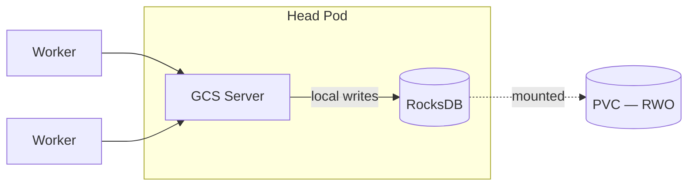
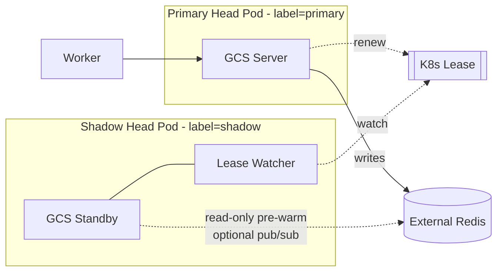
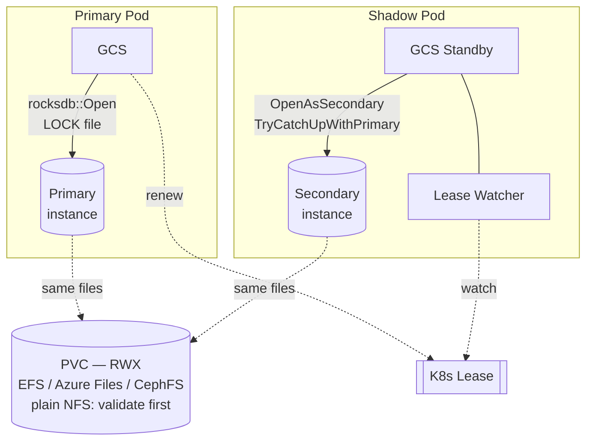
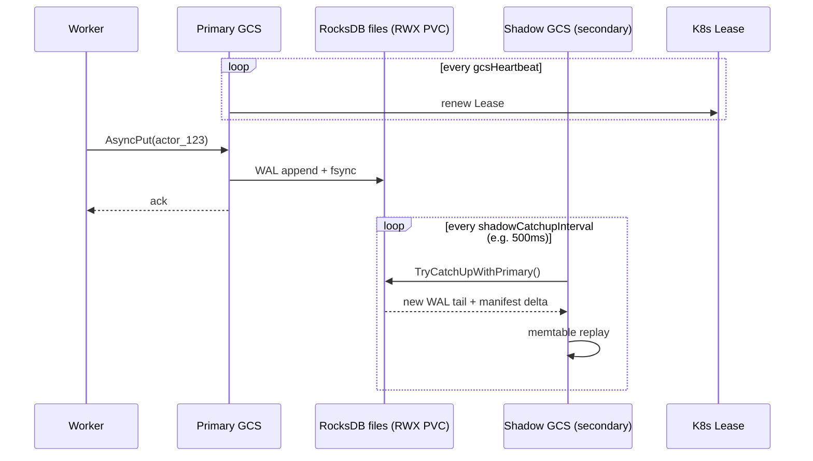
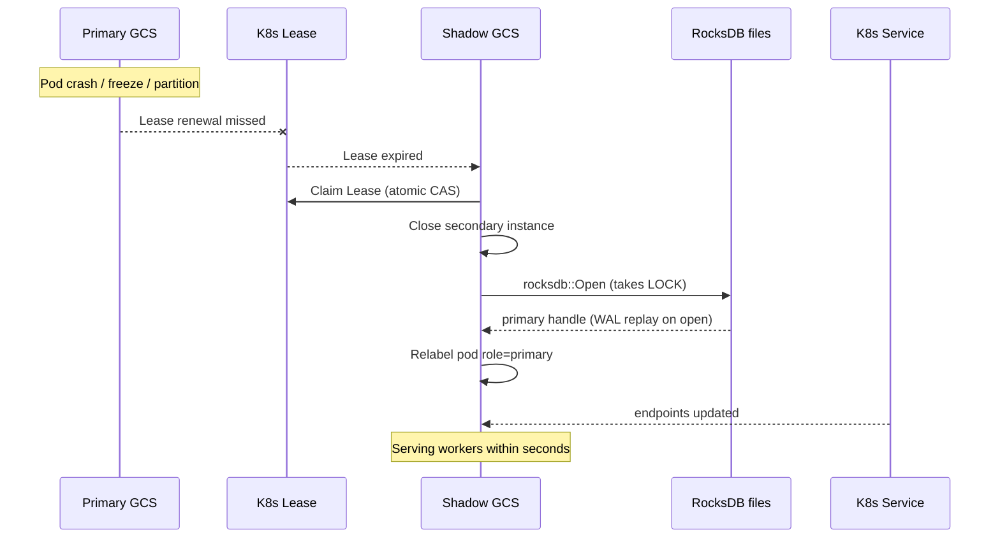
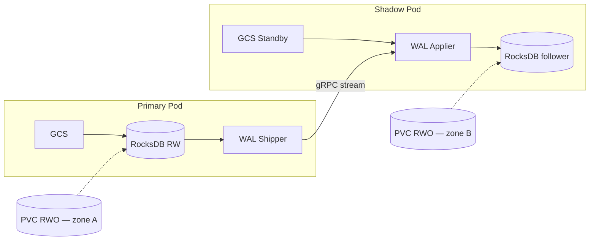
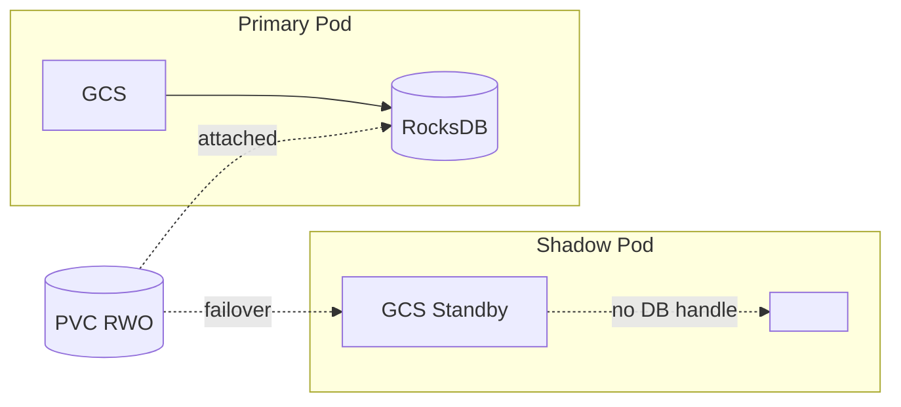
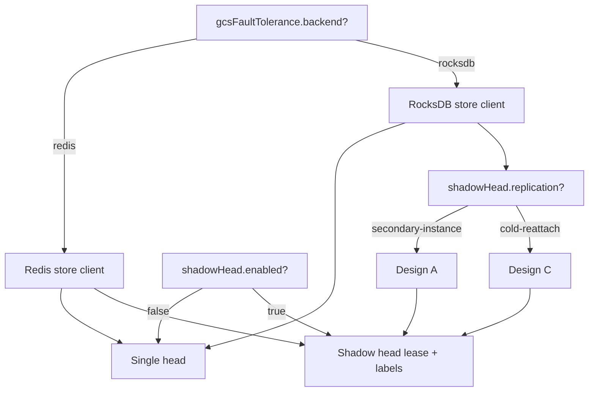

# Design: Ray Shadow Head with Embedded RocksDB Backend

**Status:** Pre-REP working draft
**Authors:** Santosh Jha (LinkedIn)
**Related work:**

- REP [`2026-02-23-gcs-embedded-storage.md`](../reps/2026-02-23-gcs-embedded-storage.md) — RocksDB embedded backend for GCS (LinkedIn)
- External doc [`[External]-Ray-Head-Fault-Tolerance-Enhancements.md`](./[External]-Ray-Head-Fault-Tolerance-Enhancements.md) — Option 3: Ray Shadow Head (Google)

## 1. Why combine these two proposals

The two in-flight proposals solve adjacent but distinct problems:

| Proposal | Solves | Gap it leaves |
|---|---|---|
| **Embedded RocksDB (LinkedIn REP)** | Removes the external Redis dependency — "batteries-included" persistence on a local PVC | Head node is still a SPOF; recovery requires pod restart → cold GCS reopen (15s–5min) |
| **Shadow Head (Google proposal)** | Warm standby GCS promotes in seconds on primary failure | Standby still needs a **shared** state source; the proposal currently names Redis |

Combining them produces a design that keeps the operational simplicity of the embedded backend while getting shadow-head-grade failover latency:

- **No external DB cluster** to provision, monitor, or upgrade.
- **Failover in seconds** (image already pulled, GCS process already warm, state already caught-up).
- **Single user-facing concept** — "turn on GCS FT"; the operator picks backend + shadow automatically.

The explicit goal of this doc is to show the two paths do **not** conflict, and to spell out the one shared design question they introduce: *how does a warm standby stay in sync with a single-writer embedded store?*

## 2. Design goals and non-goals

### Goals

1. Shadow head can be promoted to primary **without re-reading GCS state cold** from disk.
2. A cluster configured with `backend: rocksdb` and `shadowHead: enabled` requires **zero extra user config** beyond those two flags.
3. Failover is **safe under split-brain** (old primary losing its lease must not corrupt the DB).
4. The design is **layered**: operators can use embedded RocksDB without shadow head (today's REP), or shadow head without embedded RocksDB (Google's Option 3 with Redis). Turning both on is additive, not a third product.
5. Recovery semantics match the existing GCS FT contract: acknowledged writes are durable across primary loss.

### Non-goals

- Multi-writer GCS / true active-active. RocksDB is single-writer; this design keeps that.
- Cross-region or cross-zone HA beyond what the underlying PV topology supports (see §7).
- Persisting Python driver memory, in-flight plasma objects, or NCCL group state — same non-goals as both parent proposals.
- Replacing the shadow head lease mechanism — we reuse the K8s `Lease` object described in the Google doc.

## 3. Recap: baseline architectures

### 3a. Embedded RocksDB, no shadow (today's REP)



Failure mode: pod dies → K8s restarts head pod → same PVC re-attaches → GCS reopens RocksDB → reads state cold → workers reconnect. Downtime: 15s–5min.

### 3b. Shadow head with Redis (Google Option 3)



Failure mode: primary loses lease → shadow claims lease → relabels pod → K8s service re-routes → shadow promotes. Downtime: seconds.

## 4. Core challenge: a single-writer store + a warm standby

RocksDB allows exactly **one process to open a DB for writes** at a time. A second writer corrupts the manifest/WAL. Three knobs exist in RocksDB's C++ API that are relevant here:

| Mode | What it does | Applicable role |
|---|---|---|
| `DB::Open` (default) | Exclusive read-write. Takes an OS file lock on `LOCK`. | **Primary** |
| `DB::OpenForReadOnly` | No WAL tailing. Reads the manifest at open time; becomes stale. | Not useful — too stale for promotion. |
| `DB::OpenAsSecondary` | Read-only but can call `TryCatchUpWithPrimary()` to tail WAL + manifest from the same file system. | **Shadow standby** — this is the key primitive. |

`OpenAsSecondary` is a first-class RocksDB feature (used by CockroachDB follower reads, Kafka Streams standby replicas, TiKV Raft learners). It gives the shadow an up-to-date view without taking the write lock.

The design question is therefore about **where the two processes' file systems meet**:

1. **Same bytes, same volume** → RWX PVC shared between primary and shadow pods. (Design A)
2. **Different bytes, streamed** → primary ships WAL to shadow over the network. (Design B)
3. **Same bytes, not concurrent** → shadow only opens the DB after primary is fenced off. (Design C)

## 5. Design options

### Design A — Shared RWX PVC + RocksDB Secondary Instance ✅ recommended

Both pods mount the **same** PVC (`accessModes: ReadWriteMany`). Primary opens RW; shadow opens as secondary and calls `TryCatchUpWithPrimary()` on a timer.



#### Normal-path sequence



#### Failover sequence



#### What the design must get right

- **Fencing against split-brain.** A frozen-but-alive old primary could resume and still hold the kernel-level `flock` on `LOCK`. Three layers:
  1. **K8s Lease** is the authoritative leader token — only the lease holder accepts GCS RPCs.
  2. **RocksDB `LOCK` file** on the RWX volume provides a second interlock: on promotion, shadow waits up to `fencingGracePeriod` for the lock to be releasable, else the Primary container is forcibly killed by KubeRay via the K8s API (`DELETE --grace-period=0`).
  3. Primary reads the Lease **before every write** (or on a short ticker) and self-exits if it no longer holds it. This is the cheap, critical check that prevents a zombie writer.
- **PVC attach topology.** RWX volumes have no single-attacher restriction — both pods can mount concurrently. Cloud block storage (EBS, GCE PD, Azure Managed Disk) **cannot** be used in this design; it's RWO-only. Within RWX, not all providers are equivalent for this workload:

  | RWX provider | Underlying protocol | Recommended? | Notes |
  |---|---|---|---|
  | **AWS EFS** | NFSv4.1 (managed) | Yes | POSIX locking + fsync semantics contractually specified by AWS. |
  | **Azure Files (NFS)** | NFSv4.1 (managed) | Yes | Same story as EFS; Azure Files SMB mode is **not** supported (locking model differs). |
  | **CephFS** | Ceph native | Yes | Not NFS; has its own distributed locking that works correctly for RocksDB. |
  | **GCP Filestore** | NFSv3/v4.1 (managed) | Yes (v4.1 tier) | The v3 tier has the classic NFSv3 locking limitations — pin to v4.1. |
  | **Plain NFS** (in-cluster provisioner, on-prem NAS, `nfs-subdir-external-provisioner`) | NFSv3 or NFSv4 | Conditional | Must satisfy: NFSv4+, server exported `sync` (not `async`), `rpc.statd`/NLM or v4 state working. NFSv3 + `async` export is a **data-loss configuration** and must be rejected. |
  | **hostPath / Local PV** | — | No | Node-pinned; defeats the failover model. |

- **fsync and locking semantics on NFS-family filesystems.** Plain NFS deserves specific attention:
  - **NFSv3 locking** goes through NLM/`rpc.statd` and is widely reported as unreliable across client/server restarts. RocksDB's `LOCK` file then stops being a real interlock — the fencing story collapses to "K8s Lease only."
  - **`async` export option** on the NFS server causes the server to ack writes before they hit disk, silently breaking `fsync`. This violates the GCS FT durability contract regardless of what RocksDB does client-side.
  - **Validation requirement.** For any RWX provider not on the "yes" list above, the operator must run the GCS FT durability test (kill-during-write, verify ack'd writes survive) before we support that provider.
  - **Config check.** KubeRay should refuse to enable `shadowHead.replication: secondary-instance` on storage classes it cannot identify, rather than silently proceeding with a possibly-unsafe RWX backend.
- **Secondary lag bound.** `TryCatchUpWithPrimary()` cadence is the main knob. 500ms default is a reasonable tradeoff (low lag, low syscall rate); configurable via `RAY_GCS_SHADOW_CATCHUP_MS`.
- **Open-as-primary cost at promotion.** Reopening with the write lock triggers WAL recovery for any tail the secondary hasn't caught up to yet. In steady state this should be <100ms.

#### Pros / cons

| | |
|---|---|
| ✅ | Uses a RocksDB primitive that is well-exercised in production |
| ✅ | Shadow has sub-second-stale state, so promotion is near-instant |
| ✅ | No custom replication code — the filesystem is the replication layer |
| ❌ | Requires RWX storage (EFS/Files/Ceph), not plain block PD |
| ❌ | RWX storage is typically slower and more expensive per IOP than RWO block |
| ❌ | Shadow's read amplification during catch-up is non-zero on the shared FS |

### Design B — WAL shipping over gRPC (each pod has its own RWO PVC)

Each head pod has its own RWO block PVC. The primary streams WAL records to the shadow via a dedicated gRPC stream; the shadow replays them into its local RocksDB using `IngestExternalFile` or a custom WAL applier.



#### Pros / cons

| | |
|---|---|
| ✅ | Cheap fast RWO block storage; one PVC per pod |
| ✅ | Cross-zone: primary in zone A, shadow in zone B — survives a zonal outage |
| ✅ | No RWX fsync-correctness worries |
| ❌ | Significant new code: shipper, applier, resync-after-disconnect protocol, checksums |
| ❌ | Streaming lag = potential data loss window at failover. Must either sync-ship (latency cost) or accept async semantics |
| ❌ | Silent divergence is a real failure mode (stream bug → shadow's DB drifts but lease promotes it anyway) |

### Design C — Cold reattach (RWO PVC, unmodified RocksDB)

Primary uses an RWO PVC exactly as in the current REP. Shadow pod runs but does not touch RocksDB. On failover, K8s detaches the PVC from the old primary, attaches to the shadow, and the shadow opens RocksDB for the first time.



#### Pros / cons

| | |
|---|---|
| ✅ | Simplest — reuses today's REP unchanged; RocksDB stays strictly single-writer |
| ✅ | No RWX, no WAL streaming, no split-brain-via-DB risk |
| ❌ | Cloud PV detach+attach is 15–60s on EBS/GCE-PD/Azure Disk — defeats the "seconds-level failover" promise of shadow head |
| ❌ | Shadow head still needs to do cold RocksDB open + WAL recovery on promotion |
| ❌ | Essentially the same failure mode as plain REP-only; shadow mostly saves image-pull time |

## 6. Recommendation

Ship **Design A** as the combined path, with **Design C** available as a degraded-but-working fallback when RWX storage is not available. Design B is deferred to future work.

Rationale:

1. **A gives the property the combined feature promises** — sub-second failover with no external DB. C does not; B gives it but at much higher engineering cost.
2. **RWX is table stakes in modern K8s** — managed NFSv4.1 (EFS, Azure Files, GCP Filestore v4.1) and CephFS are all widely operated and give well-defined fsync+locking semantics. Plain NFS works too, but with caveats spelled out in §5 / §9. It is not an exotic requirement.
3. **`OpenAsSecondary` is production-proven** in CockroachDB, TiKV, and Kafka Streams — the risk surface is small.
4. **C as fallback covers clusters without RWX** — operators who only have RWO block storage can still use embedded RocksDB and still get a shadow pod that saves them image-pull time on failover. It's strictly better than today.
5. **B's main draw (cross-zone HA) can be layered on later** without changing the public API, because the `shadowHead.replication` config axis already exists in this design.

## 7. User-facing configuration

Additive to the REP's existing `gcsFaultTolerance.backend: rocksdb`:

```yaml
apiVersion: ray.io/v1
kind: RayCluster
spec:
  gcsFaultTolerance:
    backend: rocksdb
    storage:
      size: 1Gi
      storageClassName: efs-sc          # must be RWX if shadowHead is enabled
    shadowHead:
      enabled: true
      replication: secondary-instance   # one of: secondary-instance | cold-reattach
      catchupIntervalMs: 500            # Design A only
      fencingGracePeriodSec: 5
```

Validation: if `shadowHead.replication: secondary-instance` is set, the operator must verify the underlying StorageClass supports `ReadWriteMany`. If the user requests `secondary-instance` on an RWO-only storage class, the operator rejects the RayCluster with a clear error (not a silent fallback — silent degradation of HA guarantees is a footgun).

## 8. Why this does **not** conflict with either parent proposal

- **REP-only path is unchanged.** If `shadowHead.enabled: false`, the operator creates an RWO PVC exactly as today's REP specifies. Nothing in the REP needs to change.
- **Shadow-head-only path is unchanged.** If `backend: redis` + `shadowHead.enabled: true`, you get the Google doc's Option 3 as written. Neither this design nor the REP touches that path.
- **The combined path composes.** The shadow head's lease + labeling mechanism is unchanged. Only the state-sync strategy between primary and shadow is new, and it is gated behind `shadowHead.replication` to leave Redis-backed shadow head untouched.



Every leaf in this tree is a supported configuration. The two proposals compose orthogonally.

## 9. Risks and open questions

1. **fsync semantics across RWX providers.** We need to validate each supported provider under the GCS FT durability test. The concrete matrix:
   - **Managed NFSv4.1 (EFS, Azure Files NFS, GCP Filestore v4.1 tier):** expected to pass; contractually specified by the cloud provider. Run the test anyway as a regression gate.
   - **CephFS:** expected to pass; not NFS, uses its own distributed locking. Run the test.
   - **Plain NFS (NFSv4 with `sync` export):** may pass, must be validated per deployment. NFSv3 is **not** supported for this design — its locking is too unreliable for the `LOCK`-file fencing layer.
   - **`async` NFS exports:** silently break `fsync`. KubeRay should reject storage classes it can detect as `async`, and the docs must call this out explicitly.
2. **`TryCatchUpWithPrimary()` failure modes.** If the manifest is truncated or a WAL segment is corrupted mid-read, the secondary may fail to advance. Today's RocksDB returns an error; we need a clear shadow-side action (log, alarm, stay as-is, fall back to cold reopen on promotion).
3. **Fencing gap.** The "read the Lease before every write" pattern adds a Lease read to the write path. If we do it only on a ticker, there is a window (ticker period) where the old primary can commit a write that the new primary will not see. Acceptable if ticker ≤ shadow's catchup lag; needs a clear numeric contract.
4. **RocksDB `LOCK` file release across NFS.** If an old primary is `kubectl delete --grace-period=0`'d, does its `flock` release in time for the new primary's `Open`? On NFSv4 this depends on the server's state-recovery timeout (typically ~90s). On plain NFS this is the weakest part of the design — which is why the K8s Lease, not the `LOCK` file, is the primary fencing mechanism. Empirically validate per RWX provider and record the observed grace window.
5. **Storage class validation at admission time.** KubeRay needs to introspect the StorageClass and know: (a) whether it supports RWX, and (b) whether it is on the supported-provider allowlist. There is no generic K8s API for (a) or (b), so we need a curated allowlist keyed on `provisioner` strings (`efs.csi.aws.com`, `file.csi.azure.com`, `filestore.csi.storage.gke.io`, `ceph.com/cephfs`, etc.), with an explicit opt-in flag for unknown provisioners that shifts the durability-validation burden to the operator.
6. **Driver/submitter resilience is still separate work.** Same caveat as the REP — workers reconnect automatically, but driver reconnection during the shadow-head failover window needs the same hardening the REP already flags as follow-on.

## 10. Phased delivery

| Phase | Scope | Gate |
|---|---|---|
| **P0 — REP baseline** | RocksDB store client + KubeRay PVC lifecycle (no shadow) | REP's own acceptance criteria |
| **P1 — Cold-reattach shadow (Design C)** | Shadow pod, lease, label-flip; primary still holds RocksDB alone | E2E failover ≤ 60s |
| **P2 — Secondary-instance shadow (Design A)** | `OpenAsSecondary` + catchup loop; RWX PVC lifecycle; fencing | E2E failover ≤ 5s; durability parity with P0 |
| **P3 — Fencing hardening** | Lease-read-before-write, kill-old-primary-on-promotion, RWX provider matrix | Chaos tests (kill, freeze, partition) pass |
| **P4 — (deferred) WAL shipping (Design B)** | Cross-zone HA on RWO block PVs | Only if zonal HA becomes a hard requirement |

Phases P1 and P2 can ship independently. An operator who gets P1 already has a better story than today; P2 is the "seconds-level failover" milestone.

## 11. Test plan additions

On top of the REP's test plan:

- **Secondary catch-up correctness.** Write N keys on primary, verify shadow sees them within `catchupIntervalMs × K`.
- **Promotion durability.** Ack a write on primary, kill primary, promote shadow, verify the write is visible.
- **Split-brain safety.** Freeze primary's network (iptables DROP) but keep the process alive; verify the old primary's next write fails because the lease check rejects it.
- **Forced fencing.** Keep old primary alive past lease expiry; verify KubeRay kills its container and the new primary's `Open` succeeds within `fencingGracePeriodSec`.
- **RWX provider matrix.** Run the GCS FT durability test suite against EFS, Azure Files (NFS mode), GCP Filestore (v4.1 tier), CephFS, and at least one plain NFSv4 server configured with `sync` exports. Record a pass/fail table per provider and publish as part of the docs.
- **Rolling upgrade.** Verify that upgrading an existing `backend: rocksdb` cluster to add `shadowHead.enabled: true` does not corrupt the existing RocksDB data.

## 12. Open follow-ups for alignment with the Google REP

Items to discuss with the Google authors before either REP lands:

1. **Shared lease contract.** What exactly is the Lease's `spec.holderIdentity` format? Both proposals need the same format so they can interoperate with the same KubeRay controller logic.
2. **Label convention.** The Google doc uses `primary` / `shadow` pod labels to drive service endpoints. Confirm the label key (`ray.io/head-role`?) so both proposals write the same one.
3. **Shadow pod resource shape.** Does the shadow pod get the same resource request as primary, or a reduced one? For RocksDB secondary, the shadow needs enough memory for the block cache + write buffers during catch-up, so it's close to primary.
4. **Pre-warm pub/sub (Google doc §3).** The Google doc mentions pub/sub-based pre-warming for Redis-backed shadow. For RocksDB-backed shadow, `OpenAsSecondary` + `TryCatchUpWithPrimary` *is* the pre-warm mechanism — we should make clear this is an equivalent, not an additional, feature.
5. **Naming.** "Shadow head" vs "standby head" vs "follower head" — align terminology across both REPs.
